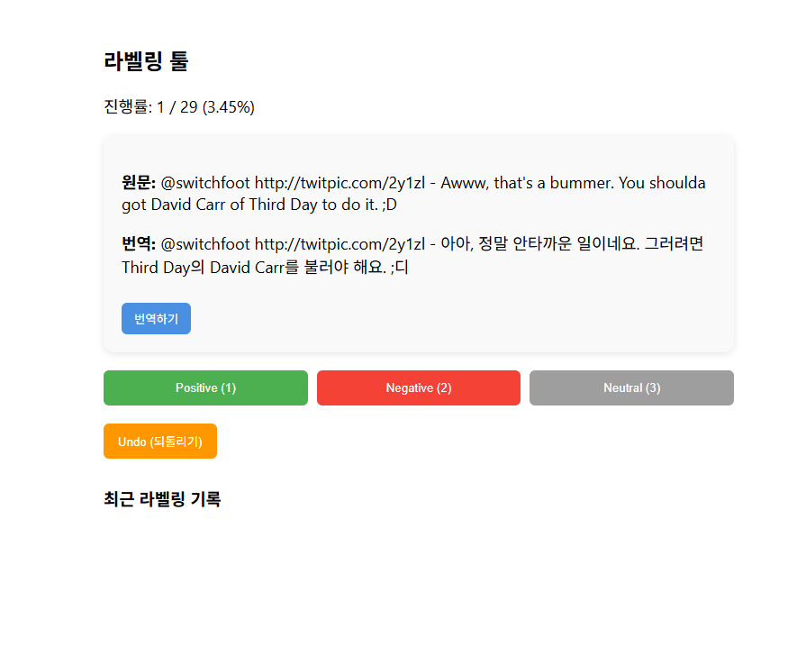

# kaggle-labeling-tool-AI
# AI Sentiment Labeling Tool (with Translation & Undo)

이 프로젝트는 Sentiment140 데이터셋 기반으로 만든 **감정 분석 라벨링 툴**입니다.  
React + Node.js 기반으로 구성되어 있으며, 다음과 같은 기능을 제공합니다:

- 원문 + 한국어 번역 표시 (Google Translate API 기반)
- Positive / Negative / Neutral 라벨링
- 라벨링 진행률 표시
- 최근 라벨링 히스토리 표시
- Undo(되돌리기) 기능
- 카드 스타일 UI 디자인

실제 AI Trainer 라벨링 워크플로우를 그대로 구현한 프로젝트입니다.

---

## 🚀 프로젝트 소개

이 프로젝트는 감정 분석 모델을 학습시키기 위한 **라벨링 도구(Labeling Tool)**입니다.  
Sentiment140 데이터셋의 트윗 문장을 불러오고, 사용자가 직접 감정 라벨을 선택하여 저장할 수 있습니다.

또한, 라벨링 편의성을 위해 다음 기능을 포함합니다:

### ✔ 한국어 번역 기능  
영어 트윗을 자동으로 한국어로 번역하여 라벨링 정확도를 높입니다.

### ✔ 진행률 표시  
현재 몇 개의 문장을 라벨링했는지 직관적으로 확인할 수 있습니다.

### ✔ Undo 기능  
잘못 라벨링한 문장을 즉시 되돌릴 수 있습니다.

### ✔ 최근 라벨링 히스토리  
최근 10개의 라벨링 기록을 확인할 수 있습니다.

이 프로젝트는 **AI Trainer 포트폴리오** 또는 **ML 데이터 라벨링 실습**에 적합합니다.

---

## 🛠 실행 방법

### 1) 서버 설치 및 실행

```bash
cd server
npm install
node index.js


---

## 📸 스크린샷

### 🔹 메인 라벨링 화면
사용자는 원문과 번역문을 확인한 뒤 감정 라벨을 선택할 수 있습니다.
### 🔹 번역 기능
영어 트윗을 자동으로 한국어로 번역하여 라벨링 정확도를 높입니다.
### 🔹 라벨링 진행률 표시
현재 라벨링한 문장 수와 전체 대비 퍼센트를 직관적으로 확인할 수 있습니다.
### 🔹 Undo & 히스토리 기능
최근 라벨링한 문장을 확인하고, 잘못된 라벨을 되돌릴 수 있습니다.




---
